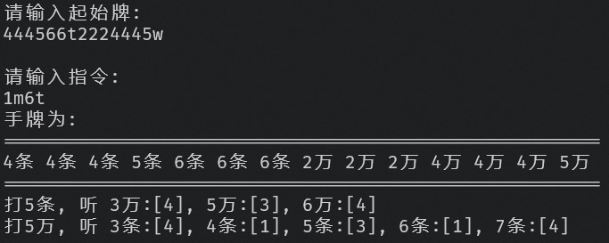

# MaJiangCal

模拟麻将打牌行为, 并在每次摸牌之后且能听牌是给出指示:

麻将指令格式共4位:
  第一位: 1(自己) 3(其他人).
  第二位: m(摸牌) d(打牌) p(碰牌) g(杠牌)
  第三四位: <牌面> 1t(1条) 2b(2饼) 3w(3万).
  
例如:
1m4t代表自己摸了4条.
3d7t代表其他人打了7条.
1p3w代表自己碰了3万.
3g6b代表其他人杠了6饼.

输入起始牌时应使用例如
<1234w5678t56789b>的格式,
他代表手牌为 '一万 二万 三万 四万 五条 六条 七条 八条 五饼 六饼 七饼 八饼 九柄'.

截图:

